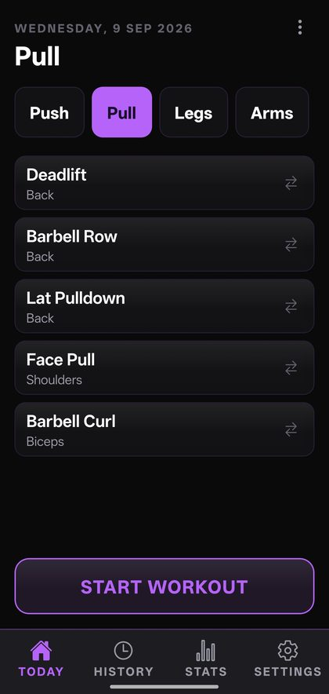
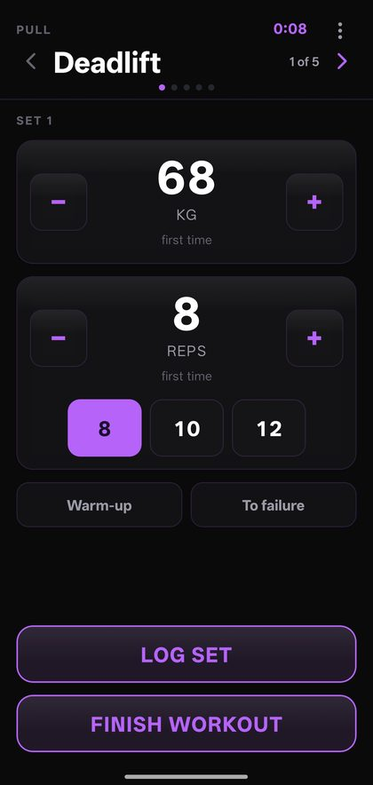
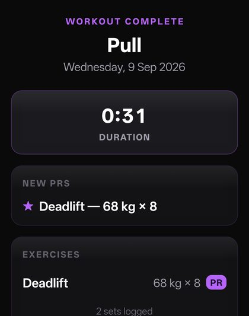
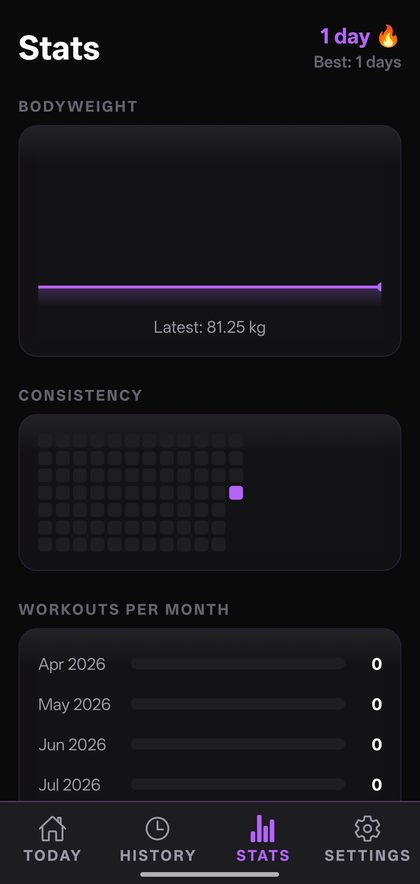
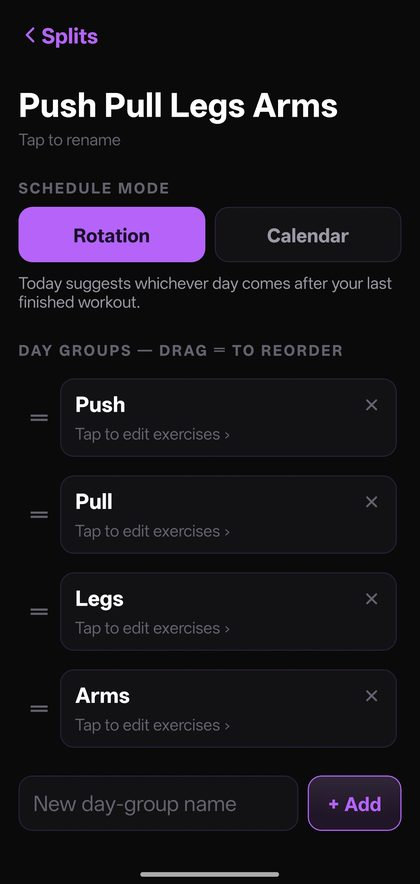
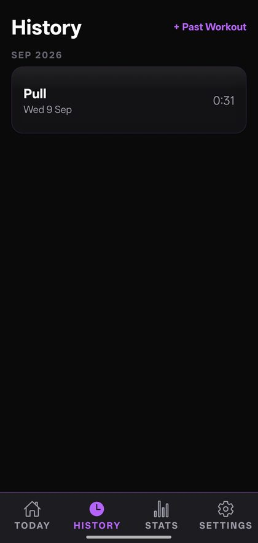
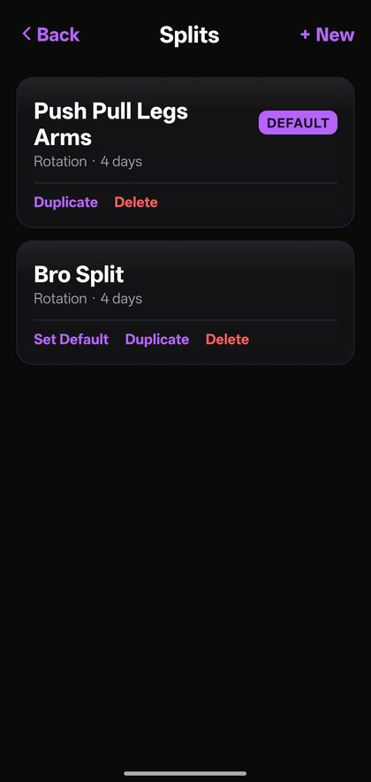
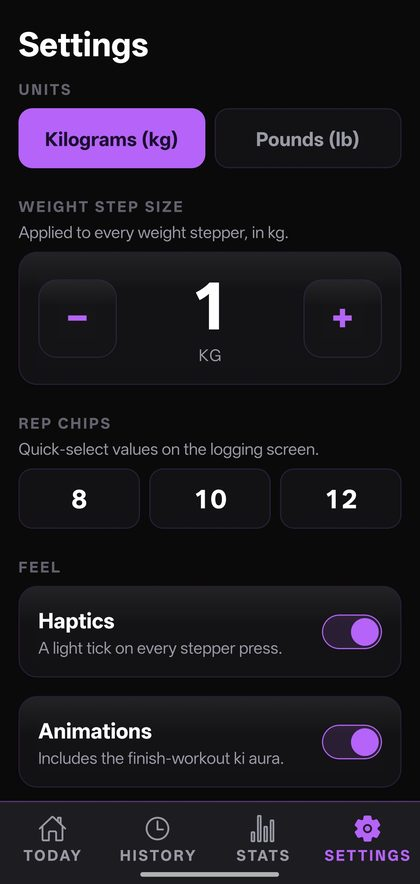
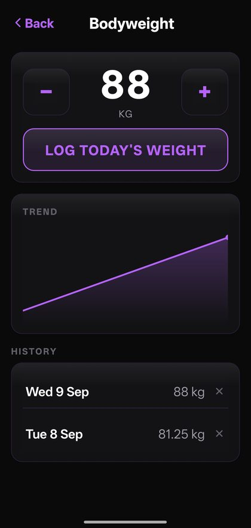
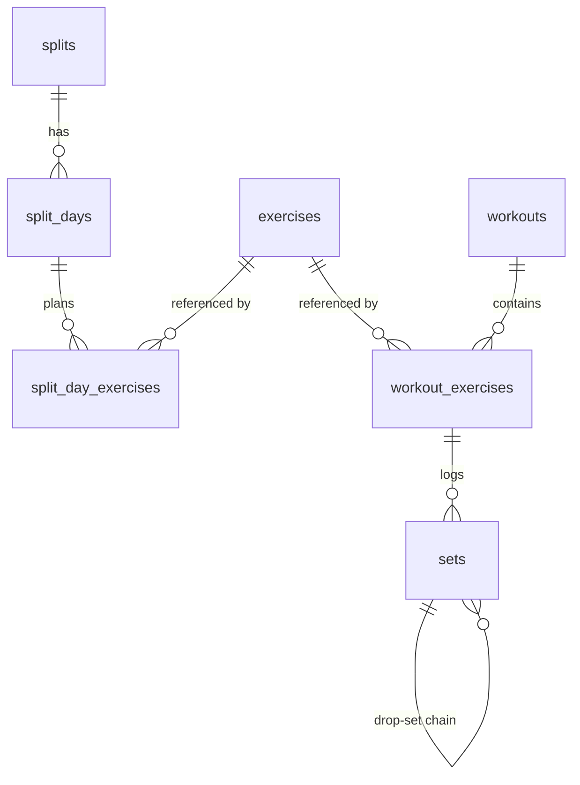

<div align="center">


# PowerLevel

**An offline-first workout tracker for Android. Logging a set takes about two taps.**

[](https://expo.dev)
[](https://reactnative.dev)
[](https://www.typescriptlang.org)
[](https://www.sqlite.org)

[](LICENSE)

</div>

---

## What it is

A workout tracker built for one specific problem: mid-set, out of breath, you
should not be hunting through menus to record `62.5 kg × 10`. PowerLevel opens on
today's workout, already showing what you lifted last time, so the only decision
left is how much more.

It is **offline-first** — a local SQLite database is the source of truth, and
nothing ever waits on a network. It is Android-only, distributed as a sideloaded
APK, and built for personal use rather than an app store.

It's also a learning project. I started it as an engineering undergrad who was new
to programming, and it was written alongside a running explanation of every
decision in it.

## Screens

<div align="center">

| Today | Logging | Finished |
|:---:|:---:|:---:|
|  |  |  |
| The day's exercises, picked for you | Two taps per set | PRs, duration, bodyweight |

| Stats | Split editor |
|:---:|:---:|
|  |  |
| Streak, bodyweight trend, consistency | Drag to reorder, rotation or calendar |

</div>

<details>
<summary><b>More screens</b> — History, Splits, Settings, Bodyweight</summary>
<br>
<div align="center">

| History | Splits | Settings | Bodyweight |
|:---:|:---:|:---:|:---:|
|  |  |  |  |

</div>
</details>

## Features

| | |
|---|---|
| **Two-tap logging** | Weight and reps prefill from your last session. Hold the arrows to accelerate, or tap the number to type it. |
| **Knows what's next** | Splits run on rotation (whatever follows your last workout) or on a calendar (day-groups pinned to weekdays). |
| **Drop sets** | Chain `60×12 → 50×10 → 40×11` onto any working set. |
| **Warm-ups & to-failure** | Flag a set so it stays out of your PR maths, or mark that you emptied the tank. |
| **Live PR detection** | The moment you beat a personal record, mid-workout, it tells you. |
| **Full history editing** | Edit or delete any past set, or backfill a workout you forgot to log. |
| **Stats** | Streaks, per-exercise progress, volume trend, and a consistency heatmap. |
| **Bodyweight tracking** | One entry per day, with a trend chart. |
| **Backup & restore** | Everything to a single JSON file, and back again. |
| **kg / lb** | Stored in kilograms always; pounds are a display conversion, never a stored value. |
| **Finish animation** | A "ki aura" charge-up on the summary screen. Original art, and switchable off. |

## Built with

`Expo SDK 57` · `React Native 0.86` · `TypeScript 6` · `expo-router` ·
`expo-sqlite` · `react-native-reanimated` · `react-native-gesture-handler` ·
`react-native-svg`

### Decisions worth explaining

**Plain SQL, no ORM.** The plan called for Drizzle. It isn't here. Drizzle's Expo
driver needs Metro configuration and codegen that looked fragile on a
then-brand-new SDK 57 / RN 0.86, and the typing benefit wasn't worth the risk. The
schema is hand-written SQL migrations, versioned through SQLite's own
`user_version` pragma.

**Personal records are computed, never stored.** There is no `personal_records`
table. PRs are derived from the `sets` table on demand. That costs a query and buys
correctness: edit a workout from three weeks ago and every PR in the app is
instantly right, with no cache to invalidate.

**A schema built for sync that doesn't exist yet.** Every table carries a UUID
primary key, `created_at`, `updated_at`, `deleted_at` (soft delete) and a `dirty`
flag — all designed in from the first migration. Cloud sync is a future phase; when
it arrives it should be additive rather than a rewrite. UUIDs specifically, because
two devices creating row #7 offline would collide, and random 128-bit ids don't.

**No component libraries.** The drag-to-reorder list is hand-built on
gesture-handler and reanimated. The charts are hand-drawn SVG. Both because the
third-party options were heavier than the problem.

## Architecture

```
src/
├── app/         screens — expo-router maps each file to a route
├── components/  shared UI (Stepper, DragList, KiAura, LineChart…)
├── db/          client, migrations, seed data, types
├── queries/     every SQL statement in the app lives here
├── lib/         pure logic — units, scheduling, streaks, backup
├── hooks/
└── theme/       design tokens
```

The rule that keeps it navigable: **no screen writes SQL.** Screens call
`queries/`, `queries/` talks to SQLite. Pure logic lives in `lib/` precisely so it
can be unit-tested without a database or a phone.



Relationships are held **by convention** — `*_id` columns, with integrity enforced
by the query layer rather than declared `FOREIGN KEY` constraints.

`workout_exercises` is a *snapshot*, copied from the split the moment a workout
starts. That's deliberate: reorganising your split next month must never rewrite
what you actually did last month.

## Getting started

**Prerequisites:** Node ≥ 20, and an Android device. No Android SDK needed — builds
run in Expo's cloud.

```bash
git clone https://github.com/tushar-1-5/powerlevel-workout-tracker.git
cd powerlevel-workout-tracker
npm ci
npm start          # scan the QR code with a dev build on your phone
```

| Script | What it does |
|---|---|
| `npm start` | Start the Metro dev server |
| `npm run android` | Start and open on a connected device |
| `npm run typecheck` | `tsc --noEmit` — run this first when something breaks |
| `npm test` | Unit tests for the pure logic |

**Building an installable APK** (needs a free [Expo](https://expo.dev) account):

```bash
npx eas-cli build --platform android --profile preview
```

Bump `android.versionCode` in `app.json` for every build you intend to install
over an existing one — Android refuses to install a lower or equal version code.

## Project stats

| | |
|---|---|
| TypeScript files | 61 |
| Lines of code | ~10,600 |
| Tests | 40, on pure logic |
| Database tables | 10 |
| Runtime dependencies | 33 |

## Roadmap

- [ ] Cloud sync (Supabase + Google sign-in) — the schema is already shaped for it
- [ ] Per-set and per-workout notes — the columns exist, no screen uses them yet
- [ ] Per-exercise detail screen

## License

[MIT](LICENSE) © 2026 Tushar
